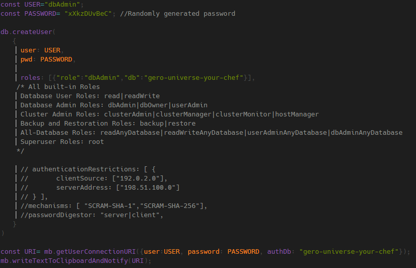

# Gero Universe Data Base

## MongoDB in Docker

Build Docker image of MongoDB: `docker build . -t gero-universe-db:latest`

Run container: `docker run -d --name gero-universe-db-container -p 27017:27017 -v C:/Docker/volumes/gero-universe-db:/data/db gero-universe-db:latest`

## Bases de datos

### Gero Universe

**Usuarios:**

- Admin:

  

  - Username: dbAdmin
  - Password: uPXnA5YsEB

### Gero Universe Your Chef

- Admin:

  

  - Username: dbAdmin
  - Password: xXkzDUvBeC
