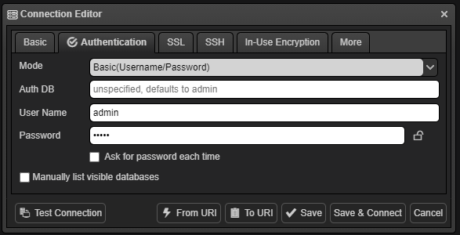

# Información

## Docker

**Docker build**: para generar una imagen a partir de un Dockerfile

- Comando: `docker build . -t gero-universe-api:latest`
  - Si ponemos el "." tenemos que estar en el directorio donde se encuentra el Dockerfile para poder generar la imagen a paritr de este.
  - Si no estamos en el directorio donde está el Dockerfile, habrá que poner el path completo de dónde es encuentra este.

 

**Docker run**: para ejecutar un contenedor.

- Comando: `docker run -d --name nombreQueQueramos -p puertoHost:puertoContainer dockerImage`
  - Ejemplo: `docker run -d --name gero-universe-db-container -p 27017:27017 -v C:/databases:/data/db gero-universe-db:latest`
- Bindings:
  - `-d`: se utiliza para ejecutar el contenedor en segundo plano.
  - `--rm`: asegura que el contenedor se elimine automáticamente cuando se detenga o termine su ejecución.`
  - `-v`: para generar volumenes que nos permitan perisitir los datos del contenedor cuando se apaguen.

## MongoDB

**Conexión a la DB desde NoSQLBooster**:

- Basic:

  

  - Server: localhost:27017
  - Port: 27017
  - Name: localhost

- Authentication:

  

  - Mode: Basic(Username/Password)
  - User Name: admin
  - Password: admin

## Angular

**Solicitudes http:** para poder realizar solicitudes http, en el app.config.ts, hay que añadir un nuevo porvider, el `provideHttpClient()`. Además, en el componente donde queramos hacer las solicitud http, en el
contructor, habra que añadir el HttpClient `constructor(private http: HttpClient) {}`, para poder así realizar un petición http.

 

**Guards**: nos sirven para proteger las rutas.

- Tipos:
  - CanActivate
  - CanActivateChild
  - CanDeactivate
  - CanMatch
- Comando para generar la guard: `ng generate guard rutaDondeQueramosLaguard --interactive`
  - Ejemplo: `ng generate guard auth/guards/isLoggedIn --interactive`
